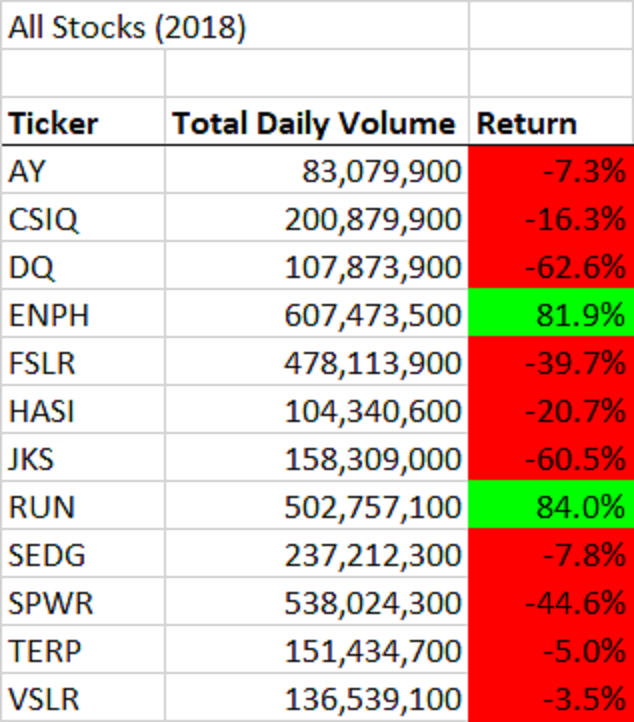

# Analyzing Green Energy Stocks using VBA’s

## Overview
Steve’s parents are interested in investing in green energy stocks. However, since they are not too informed about which stocks are the best, they put all their money in DAQO New Energy Corp (ticker: DQ). The purpose of this analysis is to review how DQ stocks compare against other green energy stocks. This project will compare the total daily volume and yearly return for all green energy stocks. With an analysis of these metrics, Steve’s parents can make a more informed decision about diversifying their green energy stock portfolio. The full analysis and raw stock data can be found in [VBA_Challenge.xlsm](link) workbook.

## Results

### Stock Performance
After thoroughly analyzing the green energy stock performances between 2017 and 2018, the results can be shown below. 
 

It looks like DQ dropped over 62% in 2018. A review of the other green energy stocks is recommended. After looking at all the stocks, 2018 was a bad year for green energy stocks. All stocks, except for ENPH and RUN had a negative return. Green energy stocks performed much better in 2017. This is also consistent for ENPH and RUN with positive yearly return percentages as well in 2017. From the tables above, we can best conclude that Steve’s parents should not put all their money in DQ but purchase some ENPH and RUN stocks as well. This is because both companies showed a positive yearly return percentage between 2017-2018, unlike their counterparts. 

### Execution Times
After refactoring the original All Stocks Analysis code, the execution times were much quicker. See below for the times. The left side is the original code, the right is the refactored code. This is about a 0.5 seconds difference in both years.

#### 2017 Original vs 2017 Refactored
 

#### 2018 Original vs 2018 Refactored
 

This was due to the following differences in each script: arrays and nested loops. 
Four arrays were used instead of one to store variables of the same type more efficiently. In addition to the tickers array, three additional arrays were created below for the second and third columns of our stock analysis. 

#### Original VBA
```
'2)Initialize an array of all tickers.
    Dim tickers(12) As String
    tickers(0) = "AY"
    tickers(1) = "CSIQ"
    tickers(2) = "DQ"
    tickers(3) = "ENPH"
    tickers(4) = "FSLR"
    tickers(5) = "HASI"
    tickers(6) = "JKS"
    tickers(7) = "RUN"
    tickers(8) = "SEDG"
    tickers(9) = "SPWR"
    tickers(10) = "TERP"
    tickers(11) = "VSLR"
```
 
#### Refactored VBA
```
    '1b) Create three output arrays
    Dim tickerVolumes(12) As Long
    Dim tickerStartingPrices(12) As Single
    Dim tickerEndingPrices(12) As Single
```

Instead of using a nested for loops in the original code, the refactored code used the following instead: (1) a **tickerIndex** variable was created to access all four arrays, (2) the **total volume** was initialized as an array, and (3) the worksheet only needed to be **activated** once. Nested for loops caused a longer execution time because the system must run through the code for more iterations. In the refactored code, there were three **for loops** that calculated the analysis: 11 times for the tickerVolume array, the total number of rows for the calculations, and another 11 times for the outputs. This refactored code only goes through **22 + total number of rows** iterations. The original code must go through the loop **11 x total number of rows iterations**.  

#### Original VBA
```
'4)Loop through the tickers.
    For i = 0 To 11
        ticker = tickers(i)
        totalVolume = 0
        'Activate data worksheet
        Worksheets(yearValue).Activate
        
'5)Loop through rows in the data.
        For j = 2 To RowCount
            '5a)Find the total volume for the current ticker.
            If Cells(j, 1).Value = ticker Then
                totalVolume = totalVolume + Cells(j, 8).Value
            End If
        
            '5b)Find the starting price for the current ticker.
            If Cells(j, 1).Value = ticker And Cells(j - 1, 1).Value <> ticker Then
                startingPrice = Cells(j, 6).Value
            End If
        
            '5c)Find the ending price for the current ticker.
            If Cells(j, 1).Value = ticker And Cells(j + 1, 1).Value <> ticker Then
                endingPrice = Cells(j, 6).Value
            End If
        Next j
        
'6)Output the data for the current ticker.
        Worksheets("All Stocks Analysis").Activate
        Cells(4 + i, 1).Value = ticker
        Cells(4 + i, 2).Value = totalVolume
        Cells(4 + i, 3).Value = endingPrice / startingPrice - 1
    
    Next i
```
 
#### Refactored VBA

##### 1. First for loop with 11 iterations:
```
    ''2a) Create a for loop to initialize the tickerVolumes to zero.
    For i = 0 To 11
        tickerVolumes(i) = 0
    Next i
```

##### 2. Second for loop with the total number of rows iterations:
 ```
    ''2b) Loop over all the rows in the spreadsheet.
    For i = 2 To RowCount

        '3a) Increase volume for current ticker
        tickerVolumes(tickerIndex) = tickerVolumes(tickerIndex) + Cells(i, 8).Value
        
        '3b) Check if the current row is the first row with the selected tickerIndex.
        If Cells(i, 1).Value = tickers(tickerIndex) And Cells(i - 1, 1).Value <> tickers(tickerIndex) Then
        tickerStartingPrices(tickerIndex) = Cells(i, 6).Value
        End If
        
        '3c) check if the current row is the last row with the selected ticker
        If Cells(i, 1).Value = tickers(tickerIndex) And Cells(i + 1, 1).Value <> tickers(tickerIndex) Then
        tickerEndingPrices(tickerIndex) = Cells(i, 6).Value
        End If
        
        '3d Increase the tickerIndex.
        If Cells(i + 1, 1).Value <> Cells(i, 1).Value Then
        tickerIndex = tickerIndex + 1
        End If
    
    Next i
```

##### 3. Third for loop with 11 iterations:
```  
    '4) Loop through your arrays to output the Ticker, Total Daily Volume, and Return.
    For i = 0 To 11
        
        Worksheets("All Stocks Analysis").Activate
        Cells(4 + i, 1).Value = tickers(i)
        Cells(4 + i, 2).Value = tickerVolumes(i)
        Cells(4 + i, 3).Value = tickerEndingPrices(i) / tickerStartingPrices(i) - 1
        
    Next i
```

## Summary

### Advantages and Disadvantages of Refactoring Code
Refactoring code can make the code more efficient. This advantage includes taking fewer steps, using less memory, or improving the logic of the code to make it easier for future users to read. However, a disadvantage of refactoring can be that it is time consuming. This is especially true for programmers who are not experts in the language, causing a risk of errors in large and complex codes.
### How the Pros and Cons of Refactoring Applies to Original VBA Script
The pros of refactoring the original VBA script included a faster execution time and a more efficient macro. The formatting was included in the same macro instead of two separate macros in the original script. For the cons, as I am not an expert in VBA, refactoring the script took almost the same time, if not longer as creating the original VBA (5-5.5 hours each). Since there were so many moving parts of the code (message box, timer, formatting, etc.), I had to remove all of that, just to focus on the functionality. Otherwise, I would keep running into errors.
